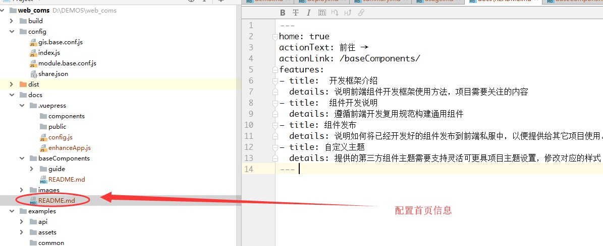
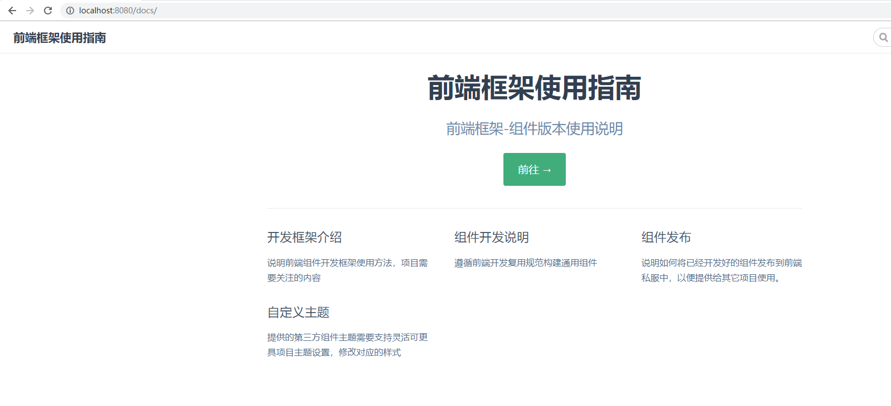
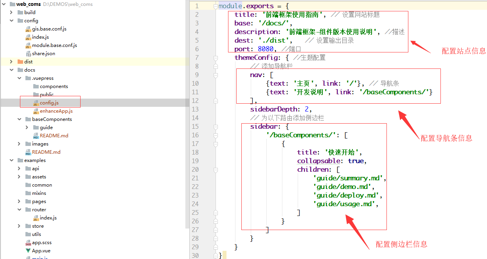
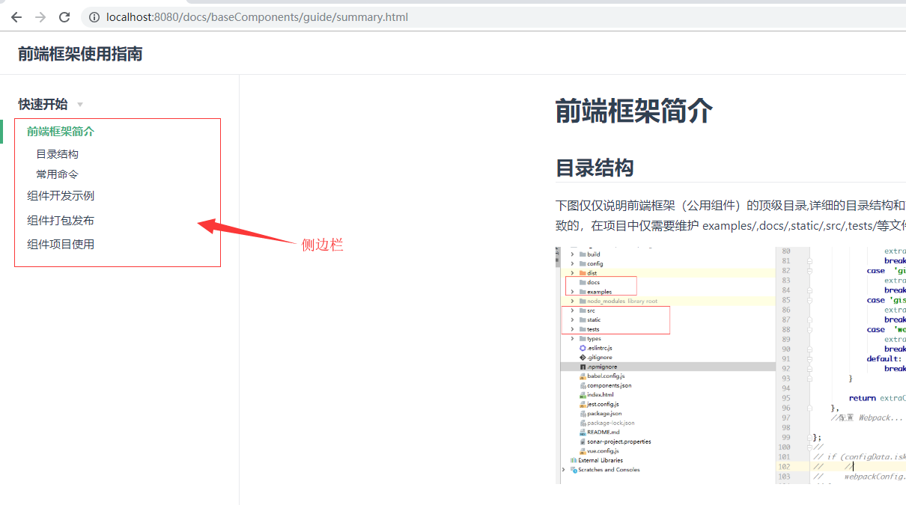
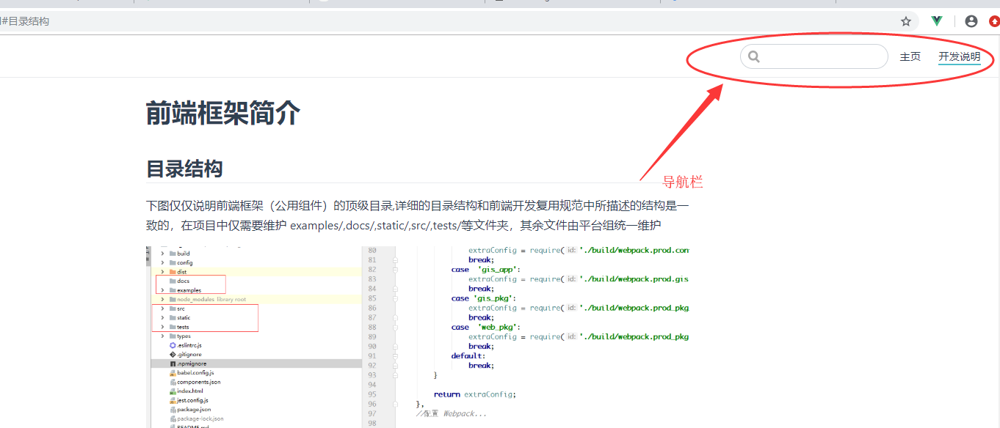

# 帮助文档工具介绍

前端框架中的组件文档采用 vuepress 工具进行编写， 要运行帮助文档程序，请首先安装 vuepress,执行`npm install -g vuepress`,然后运行`npm run docs:dev`命令启动帮助文档

详细配置请参见: [vuepress](http://caibaojian.com/vuepress/config/)

## 帮助文档说明

### 配置首页

(1) 配置信息

(2) 配置效果

### 配置侧边栏

(1) 配置信息

(2) 配置效果

### 配置导航栏

(1) 配置信息

(2) 配置效果

