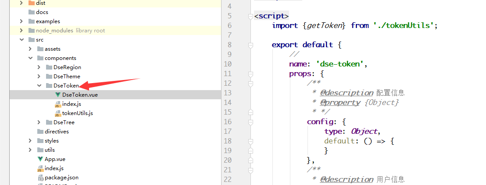
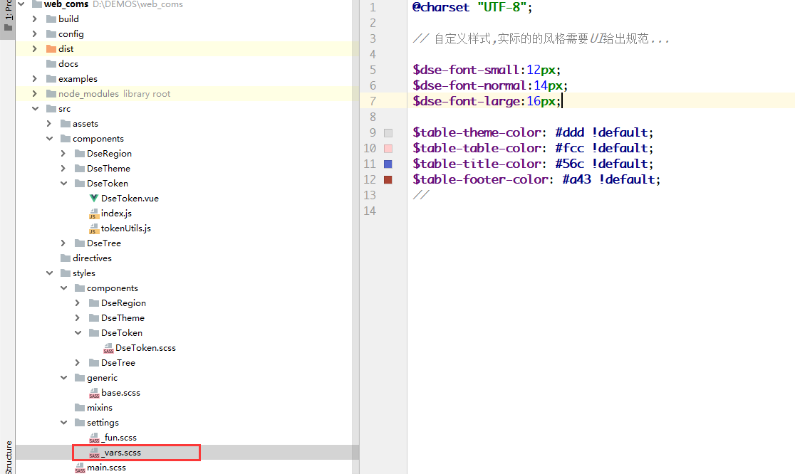
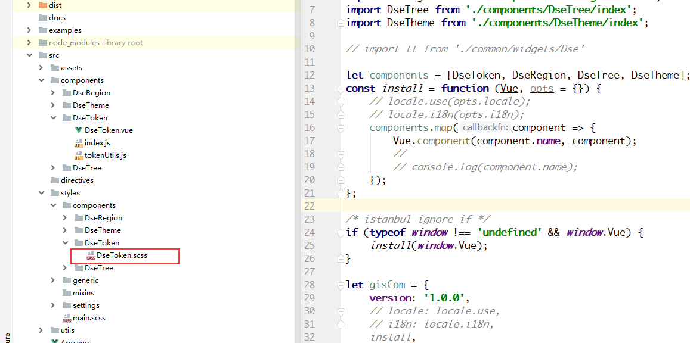
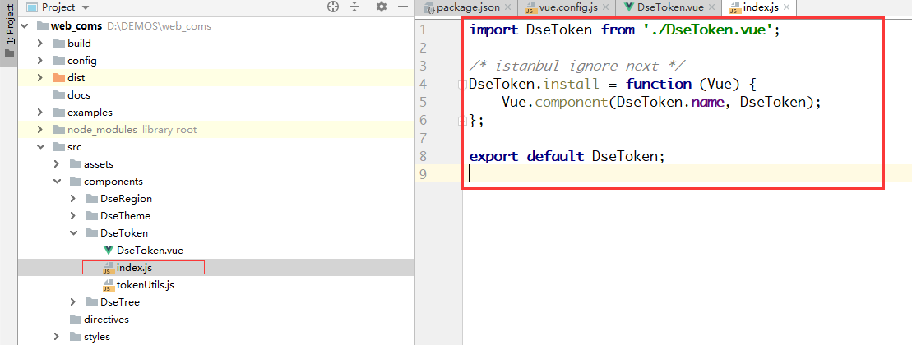
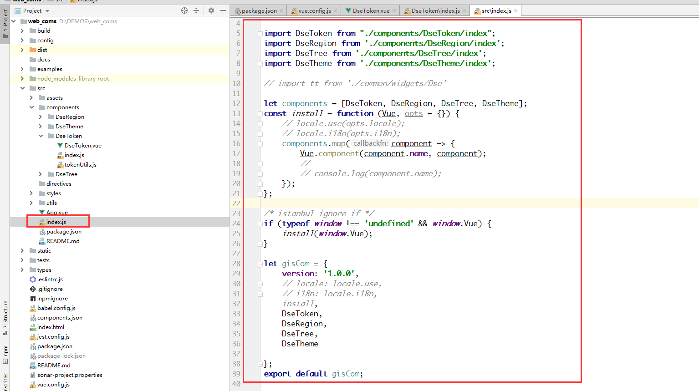
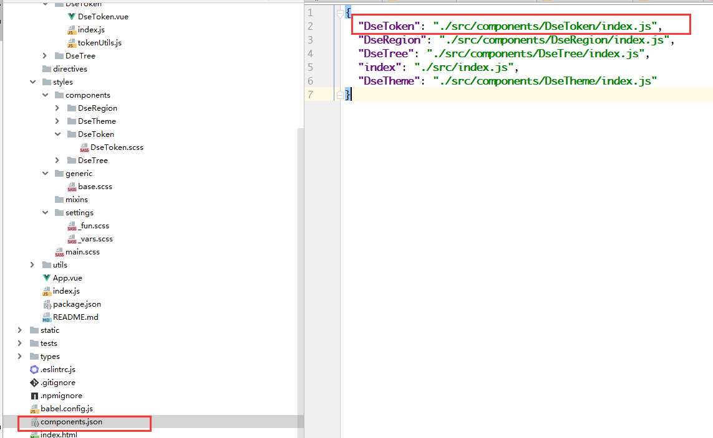

# 组件开发示例

1. 新建组件

首先根据前端开发复用规范中的原则新建组件组件,并完成样式的导入

2. 新建样式

(1) 定义通用配置项
首先根据UI设计的通用通用规范，将主题元素声明为变量

(2) 新建组件样式

3. 注册组件

组件在开发完成后，需要在项目中能够以全局或者局部的方式进行引用，因此开发组件的时候，需要对组件进行两种方式的注册

(1) 局部注册

(2) 全局注册

(3) 打包配置

