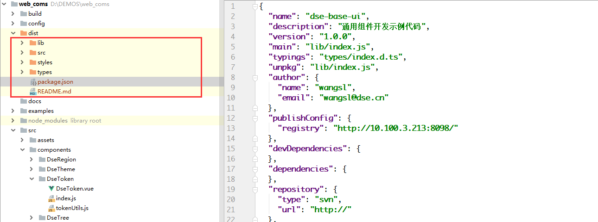
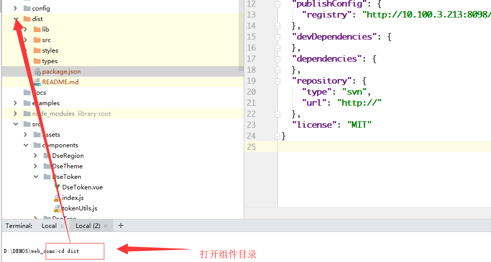
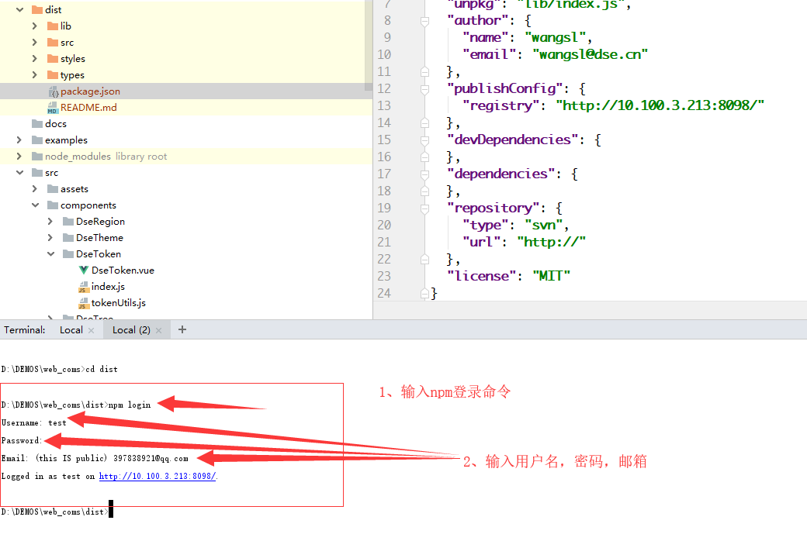
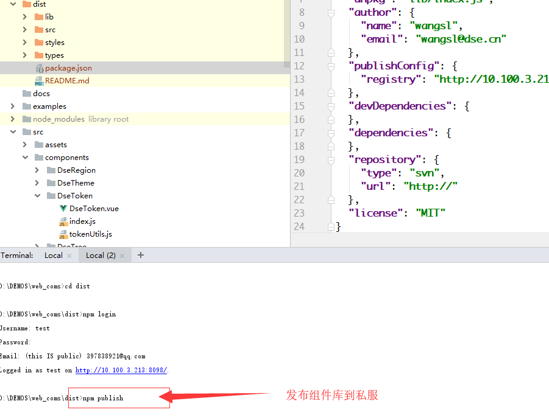
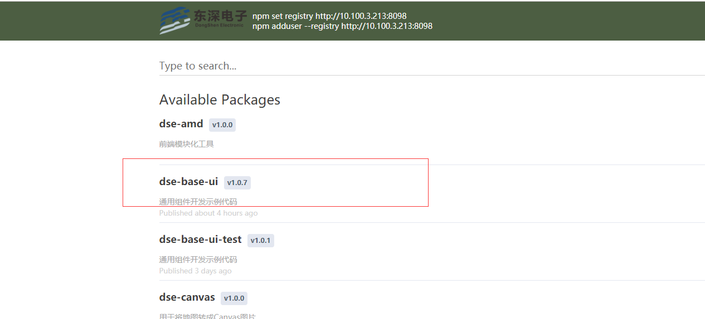
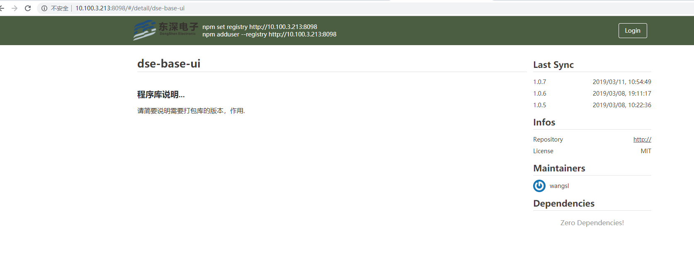

# 组件打包发布

组件发布时，版本号的定制需遵循前端开发复用规范中的版本章节，以下示例的打包目录为`dist`

## 打包

运行打包命名 `npm run pkg` 完成组件的打包,运行命令后将结果打包到dist文件夹,下图展示了打包后的目录

## 发布

现在私服已经注册了测试账号,测试时可以使用测试账号发布前端组件库到私服，
 
测试账号信息: 
用户名: test 密码: test123  邮箱: 397838921@qq.com

(1) 修改组件库的版本

在IDE中打开dist文件夹，修改组件库的版本，名称等, 版本号不能和私服中的重复，否则发布失败

(2) 通过dos进入 dist文件夹

(3) 登录前端私服

(4) 发布组件库

(5) 发布预览

组件库发布成功后，可以在前端私服中查看组件库信息，如下图所示

