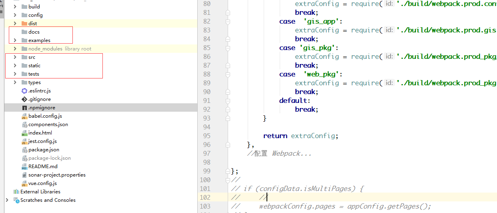

# 前端框架简介
## 目录结构

下图仅仅说明前端框架（公用组件）的顶级目录,详细的目录结构和前端开发复用规范中所描述的结构是一致的，在项目中仅需要维护 examples/,docs/,static/,src/,tests/等文件夹，其余文件由平台组统一维护

## 常用命令

1. 安装依赖

`npm install`

2. 启动框架

`npm run dev`

3. 组件打包

`npm run pkg`

4.组件发布

[组件发布详情](./deploy.md)

