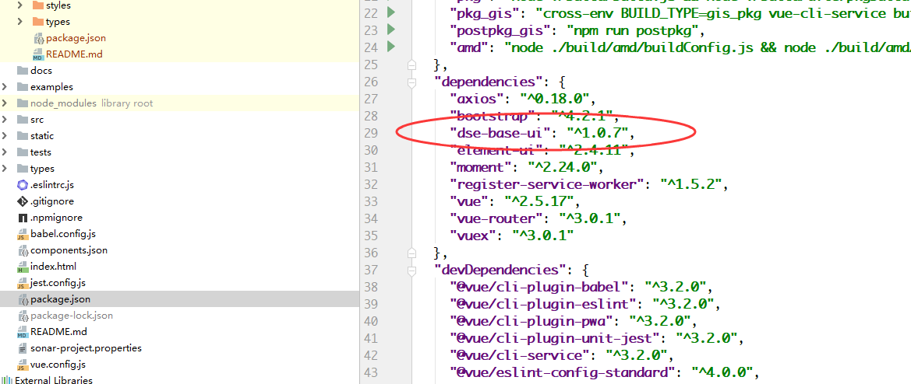
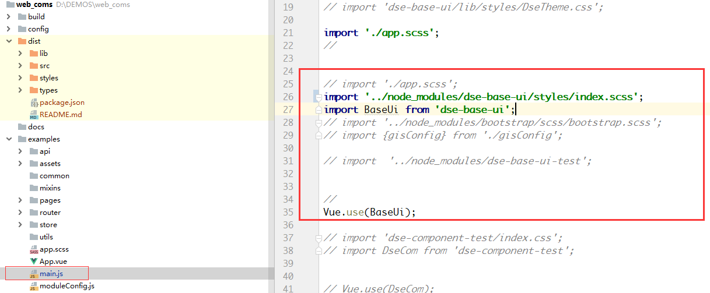
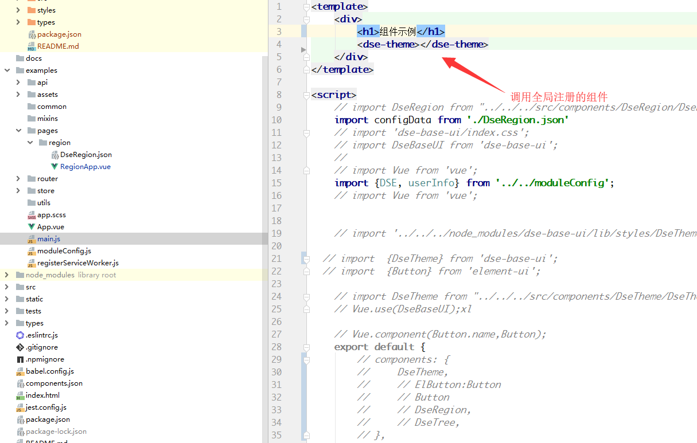
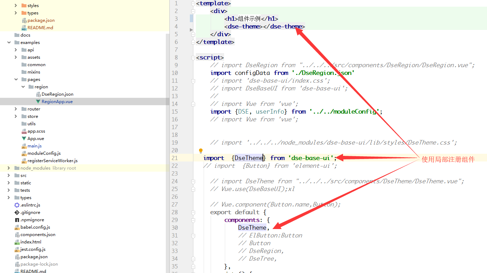
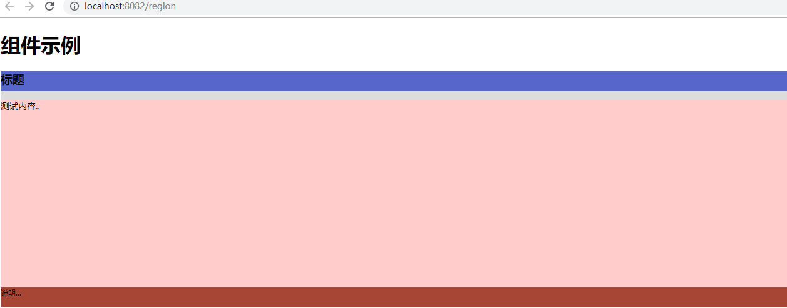
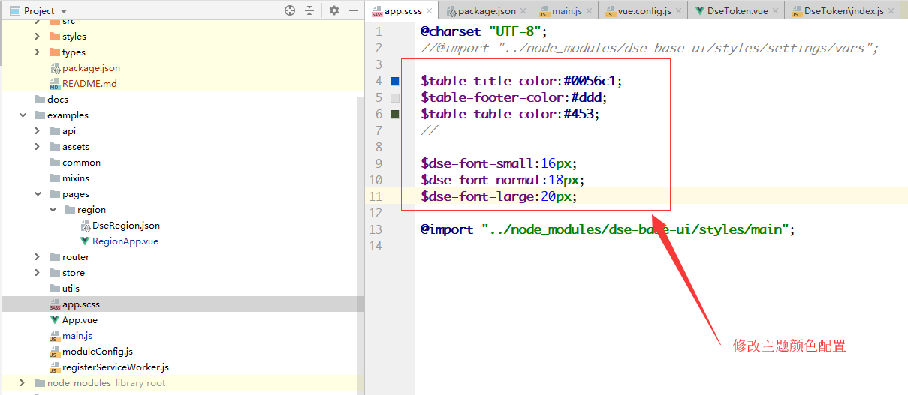
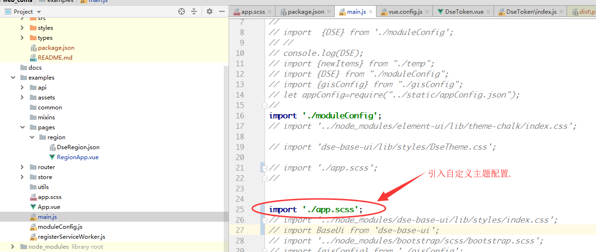
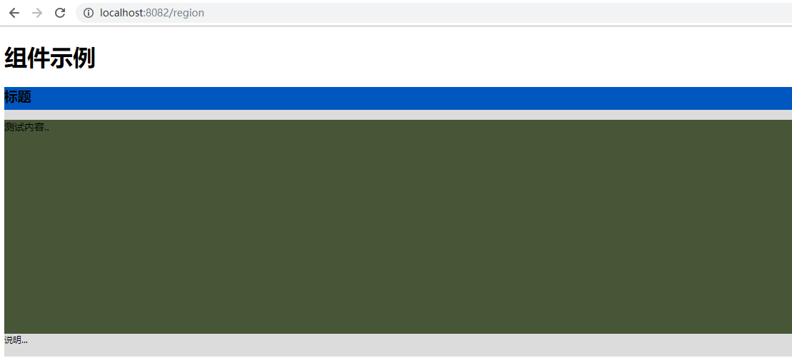

# 组件项目使用

在项目中下载组件通过 npm install xxx 命令下载，下面演示自定义组件如何引入，

## 组件引入

1. 下载组件

可以在框架根目录的package.json中的依赖部分填写组件名称，版本，然后下载组件，如下图所示:

上图中的示例还可以 通过 `npm install dse-base-ui` 命令进行下载

2. 组件引入

(1) 全局引入

组件可以通过全局引用的方式进行调用，即在主入口main.js中进行注册，其它页面进行调用,如下图所示：

页面中进行调用全局注册的组件

(2) 局部引入

页面中调用局部引入的组件,在局部调用时，需要手动引入组件关联的样式

## 主题切换

1、组件原始主题效果

2、自定义主题

(1) 修改主题配置

在项目中，可以根据实际的主题配色，全局修改公共组件的主题, 如下图所示:

(2) 修改后效果

